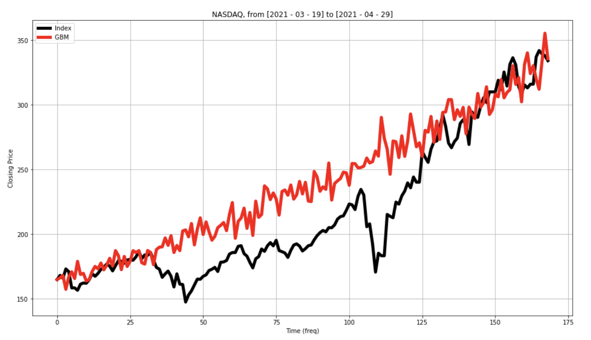
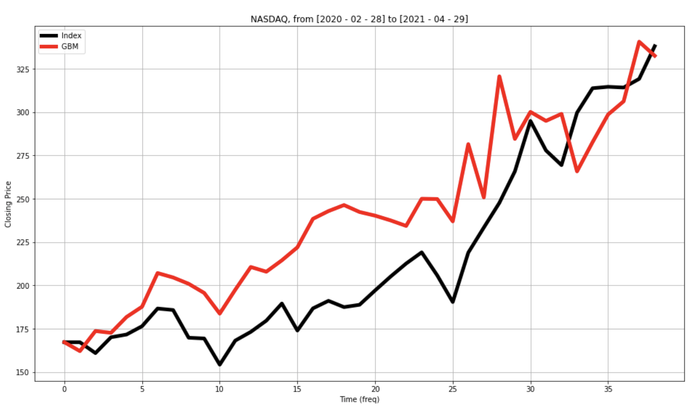
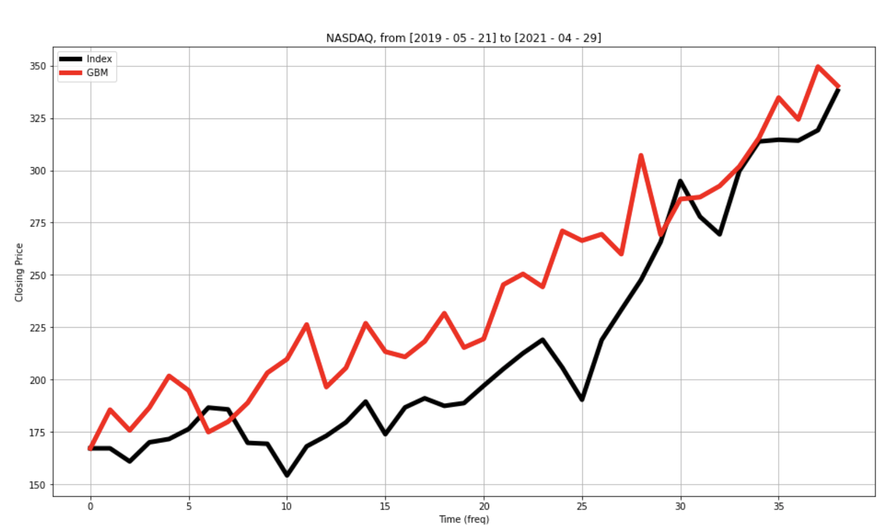
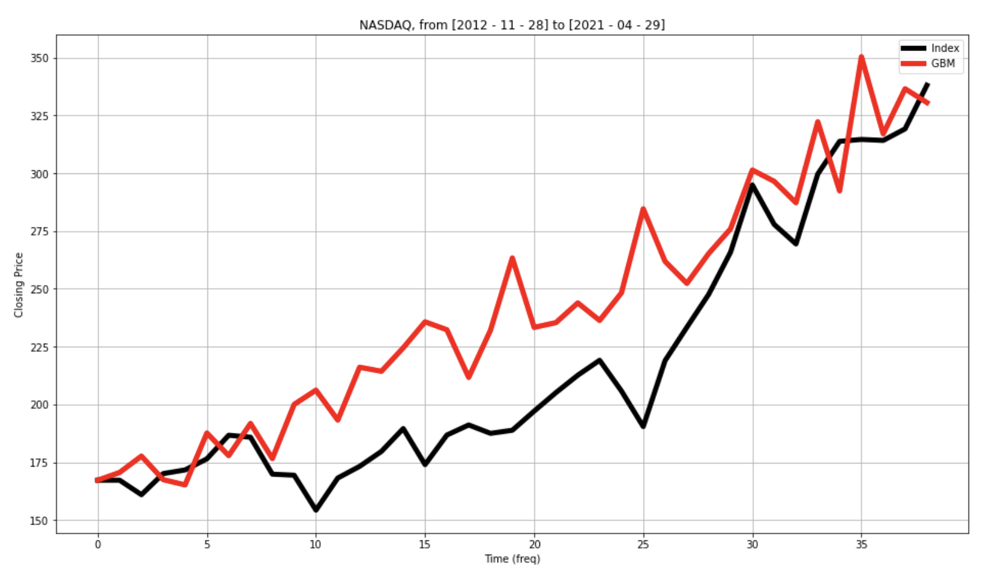
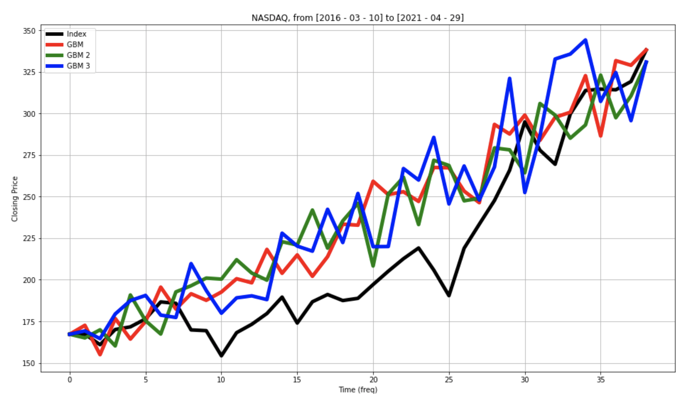
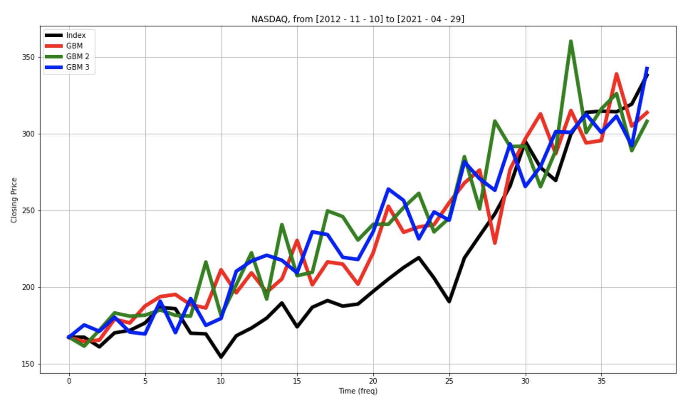
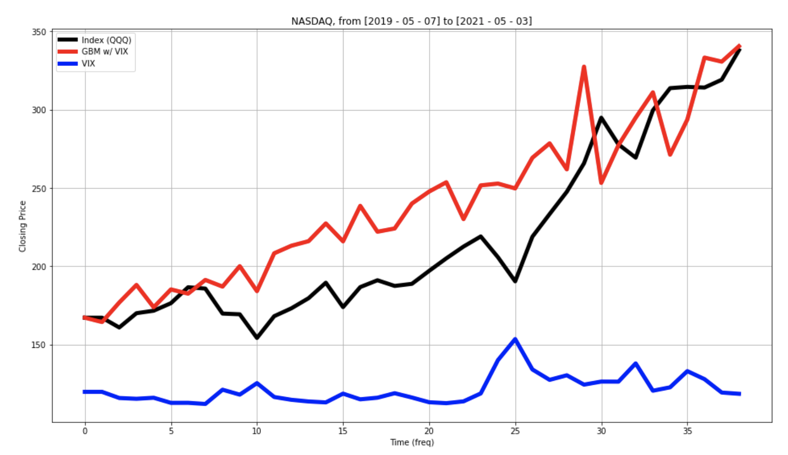
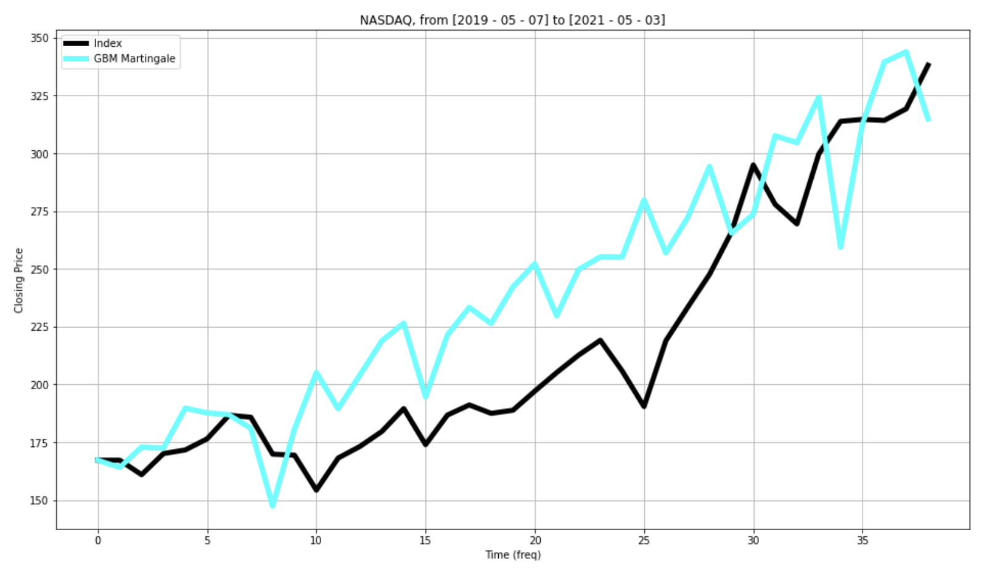

# Geometric Brownian Motion

Analysis of accuracy of GBM models on S&P500 and NASDAQ indexes

### Resulting Graphs
GBM on 30 days:

GBM on 60 weeks:

GBM on 100 weeks:

GBM on 100 months:

3 GBM walks on 60 weeks:

3 GBM walks on 100 months:

GBM with VIX adjustments on 100 weeks:

Martingale model on 100 weeks:

Code written by Dhruv Maniktala and Sean Wade
